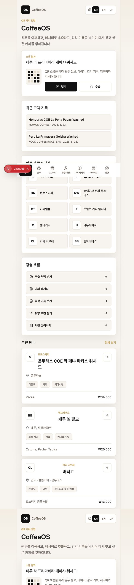
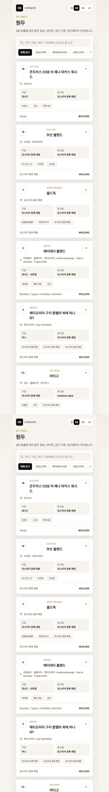
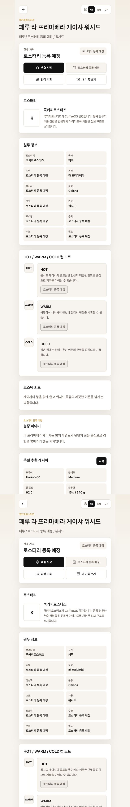
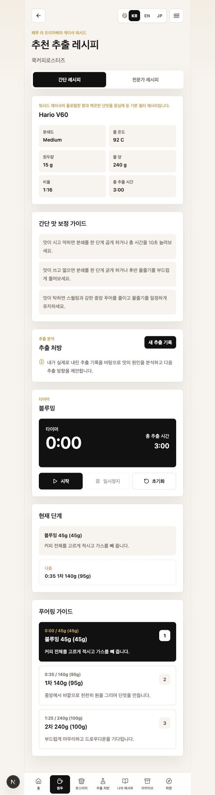
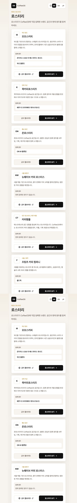

# CoffeeOS GPT 전달용 자료

이 문서는 ChatGPT가 임시 터널 링크를 열지 못할 때도 CoffeeOS의 제품 방향, 화면 구조, 핵심 흐름을 이해할 수 있도록 만든 공개 전달 자료입니다.

GitHub에서 이 문서를 열면 아래 스크린샷과 설명을 그대로 볼 수 있습니다.

## 한 줄 정의

CoffeeOS는 로스터리가 등록한 원두 정보를 QR로 고객에게 전달하고, 고객이 원두 이해, 브루잉 실행, 센서리 기록, 추출 처방, 저장 레시피, 재구매 흐름까지 이어갈 수 있게 하는 커피 경험 운영 플랫폼입니다.

## 핵심 제품 루프

```text
로스터리 원두 등록
→ QR 진입
→ 원두 이해
→ 브루잉 타이머 실행
→ 센서리 또는 추출 기록 저장
→ 추출 처방 또는 나의 레시피 저장
→ 재방문
→ 재구매
```

## 사용자 그룹

- CoffeeOS Free: QR로 들어온 일반 고객과 입문자
- CoffeeOS Pro: 홈바리스타, 커핑 참여자, 바리스타 트레이니
- CoffeeOS Roastery: 원두 정보, QR 페이지, 브루잉 가이드를 관리하는 로스터리 운영자

## 현재 구현된 핵심 라우트

- `/login`: 메인 앱 로그인
- `/signup`: 고객/홈바리스타 회원가입
- `/account`: 계정과 저장 기록 요약
- `/beans`: 공개 원두 목록
- `/beans/[id]`: 공개 QR 원두 상세
- `/beans/[id]/brew`: 공개 브루잉 레시피와 타이머
- `/beans/[id]/sensory`: 원두별 센서리 기록
- `/roasteries`: 공개 로스터리 탐색
- `/roasteries/[id]`: 공개 로스터리 상세
- `/brew-diagnosis`: 추출 처방
- `/brew-diagnosis/new`: 실제 추출 기록 입력
- `/brew-diagnosis/[recordId]`: 분석 결과와 다음 추출 처방
- `/my-recipes`: 나의 레시피
- `/my-recipes/[recipeId]/match`: 저장 레시피와 원두 궁합
- `/archive`: 저장된 센서리 기록
- `/roastery-admin/login`: 로스터리 관리자 로그인
- `/roastery-admin/signup`: 로스터리 관리자 신청
- `/roastery-admin/dashboard`: 로스터리 운영 대시보드

## 접근 정책

공개 QR 경험은 로그인 없이 접근할 수 있습니다.

- `/beans`
- `/beans/[id]`
- `/beans/[id]/brew`
- `/roasteries`
- `/roasteries/[id]`

개인 기록과 운영 기능은 로그인 후 접근합니다.

- `/`
- `/archive`
- `/my-recipes`
- `/brew-diagnosis`
- `/account`
- `/sensory/[recordId]`
- `/roastery-admin`

## 스크린샷

### 1. 로그인



### 2. 원두 목록



### 3. 원두 상세



### 4. 브루잉 타이머



### 5. 로스터리 목록



## CoffeeOS에서 특히 중요한 기능

### 원두 상세 페이지

원두 상세는 CoffeeOS의 핵심 화면입니다. 사용자는 원두명, 로스터리, 산지, 농장, 품종, 고도, 가공, 로스팅, 컵 노트, 로스팅 의도, 농장 이야기, 추천 레시피, 구매 링크를 한 화면에서 이해합니다.

### 브루잉 타이머

브루잉 단계는 실사용 혼란을 줄이기 위해 누적 물량과 이번 투입량을 함께 보여줍니다.

예시:

```text
블루밍 40g (40g)
1차 80g (40g)
2차 140g (60g)
3차 200g (60g)
```

### 추출 처방

추출 처방은 단순 레시피 생성이 아니라 사용자가 실제로 내린 레시피, 총 추출 시간, 물 온도, 분쇄도, 맛 결과를 바탕으로 과소추출, 과다추출, 불균일 추출 가능성을 규칙 기반으로 분석합니다.

표현은 “가능성이 높습니다”, “다음 추출에서 테스트해보세요”처럼 조심스럽게 유지하며, 실제 AI API가 없을 때는 AI 확정 분석이라고 말하지 않습니다.

### 나의 레시피

사용자는 마음에 들었던 레시피를 저장하고 다른 원두에 적용할 수 있습니다. 레시피-원두 궁합은 로스팅, 가공, 컵 노트, 레시피 변수 기반으로 “적합도가 높습니다”, “주의가 필요합니다”, “정보가 더 필요합니다”처럼 판단합니다.

### 로스터리 관리자

고객 앱에는 관리자 모드를 노출하지 않습니다. 로스터리 운영자는 별도 `/roastery-admin` 영역에서 원두 등록, QR URL 생성, 페이지 미리보기, 로스터리 프로필 관리를 합니다.

## GPT에게 전달할 때 쓸 수 있는 문장

```text
아래 GitHub 문서를 보고 CoffeeOS라는 커피 경험 플랫폼을 이해해줘.
이 앱은 단순한 원두 쇼핑몰이 아니라 로스터리 원두 등록, QR 진입, 원두 이해, 브루잉 타이머, 센서리 기록, 추출 처방, 나의 레시피, 재방문/재구매 흐름을 연결하는 B2B2C 커피 경험 운영 플랫폼이야.

문서:
https://github.com/dy8tvcr6cd-sys/coffeeos/blob/master/docs/GPT_HANDOFF.md
```

## 안정적인 공개 링크에 대한 메모

`trycloudflare.com` 링크는 임시 터널이라 오래 유지되지 않을 수 있습니다. 다른 사람에게 안정적으로 보내려면 GitHub 저장소를 Vercel에 연결해 정식 배포 URL을 만들어야 합니다.

앱의 QR URL 생성은 `NEXT_PUBLIC_SITE_URL`이 설정되어 있으면 해당 배포 주소를 사용합니다. 로컬 개발 주소(`localhost`, `127.0.0.1`)는 다른 사람의 기기에서 열리지 않습니다.

카톡 공유용 진입 페이지는 `/kakao`입니다. 배포 후 `https://배포주소/kakao`를 보내면 카톡 미리보기 이미지와 함께 열리고, 사용자는 원두 상세와 브루잉 타이머로 바로 이동할 수 있습니다.

관리자 화면에서 새로 추가한 원두는 현재 브라우저의 로컬 저장소에만 저장되는 프로토타입 데이터입니다. 다른 사람이 열 수 있는 QR 원두 페이지로 쓰려면 원두 데이터를 배포 데이터나 백엔드에 저장해야 합니다.

## 실제 화면 확인 방법

안정적인 리뷰 진입 페이지는 `/gpt`입니다.

- Vercel 리뷰 페이지: `https://coffee-site-bice.vercel.app/gpt`
- 스크린샷 폴더: `public/review-screenshots/`
- 리뷰 manifest: `public/review-manifest.json`
- 스크린샷 전달 가이드: `docs/SCREENSHOT_GUIDE.md`

`trycloudflare.com` 링크는 만료되거나 외부 GPT 환경에서 실패할 수 있습니다. Vercel 배포 링크가 더 안정적입니다.

라이브 페이지를 열 수 없다면 `/gpt` 페이지의 내용과 함께 `docs/GPT_HANDOFF.md`, `public/review-manifest.json`, `public/review-screenshots/`를 기준으로 CoffeeOS의 제품 흐름과 UX를 검토하면 됩니다.
